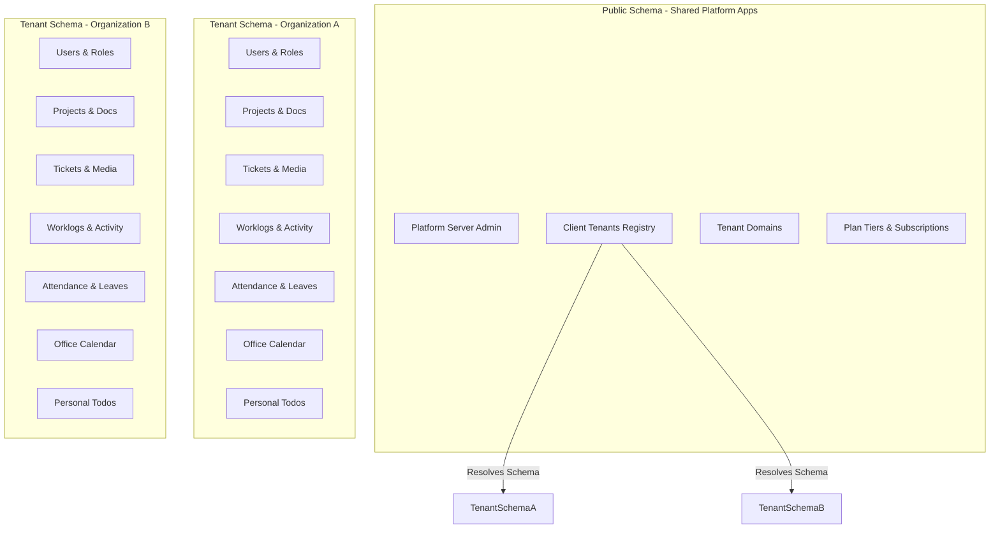

# Product Requirements Document (PRD)
## TicketHub: Multi-Tenant SaaS Project & Collaboration Suite

---

## 1. Product Overview

### Product Name
**TicketHub** (by Technest Innovations)

### Purpose
TicketHub is a multi-tenant, subscription-based workspace and project management platform designed for organizations to manage project workflows, track employee hours, and streamline office operations (attendance, leaves, calendars, and todos). 

Unlike a simple single-organization ticket tracker, TicketHub functions as a **Software-as-a-Service (SaaS)** platform where multiple tenants (clients) occupy isolated schemas under customizable subscription plans.

### Core Philosophy
1. **Data Isolation**: Multi-tenancy is enforced at the database level. Each organization has its own isolated PostgreSQL schema.
2. **Project-Scoped Visibility**: Project members can see all tickets, comments, files, and activity logs within their projects. Non-members have zero access.
3. **Role-Based Control**:
   - **Server Admin** operates at the platform/public level to manage plans and tenants.
   - **Tenant Admin** configures office settings, manages users, and monitors organization metrics.
   - **Tenant Manager** coordinates project setups, assigns tasks, and views resource worklogs.
   - **Tenant Employee** executes tasks, logs work hours, tracks personal checklists, logs attendance, and requests leave.

---

## 2. System Architecture & Tenancy Model

TicketHub utilizes `django-tenants` to implement a **single-database, multi-schema** multi-tenancy model in PostgreSQL.



### 2.1 Public Schema (Shared Apps)
- **`apps.customers`**:
  - `Client`: Tenant registry tracking PostgreSQL schema name (`schema_name`), status, and metadata.
  - `Domain`: Domain name mapping to tenant client for sub-domain/domain resolution.
  - `Plan`: Defines tier (`PlanTier.choices`: Standard vs Premium), monthly pricing, user/project limits, and toggleable modules (Attendance, Calendar, Email notifications).
  - `TenantSubscription`: Tracks active plans, expiration times, status (Active, Expired, Cancelled), and start dates.
- **`apps.platform`**:
  - `PlatformUser`: The system administrator profile (`server_admin`) that accesses the platform's super-admin dashboard.

### 2.2 Tenant Schema (Isolated Apps)
When a tenant domain is accessed, connection routing resolves the active schema, shielding data from other tenants. The tenant apps are:
- `apps.users` (Roles: Admin, Manager, Employee; Department roles: Frontend, Backend, DevOps, etc.)
- `apps.projects` (Projects, members, project documents)
- `apps.tickets` (Tickets, ticket media/attachments)
- `apps.timelogs` (Work logging)
- `apps.comments` (Ticket discussions)
- `apps.activity` (System audit logging)
- `apps.calendar` (Office schedule & event calendar)
- `apps.todos` (Personal check-lists)
- `apps.attendance` (Office hours configuration, check-ins, check-outs, leave tracking)
- `apps.notifications` (User alerts)

---

## 3. Subscription Tiers & Feature Controls

Tenants are bounded by the subscription `Plan` assigned to them by the Platform Server Admin:

| Feature/Limit | Standard Plan Tier | Premium Plan Tier |
| :--- | :--- | :--- |
| **Max Users Limit** | Configurable (e.g., 25) | Configurable (e.g., 250+) |
| **Max Projects Limit** | Configurable (e.g., 10) | Unlimited / Custom |
| **Project Management & Tickets** | Enabled | Enabled |
| **Time Tracking (Work Logs)** | Enabled | Enabled |
| **Attendance & HR Module** | Disabled | **Enabled** (Includes Check-in/out & Leaves) |
| **Calendar Module** | Disabled | **Enabled** (Shared organization events) |
| **Email Notifications** | Disabled | **Enabled** (Alerts for assignments & changes) |

---

## 4. User Roles & Permission Matrix

TicketHub features three distinct user roles inside each tenant:

### 4.1 System Roles (Tenant-Level)
* **Admin (System Manager)**:
  - Manages tenant user accounts (create, deactivate, assign base roles).
  - Configures global office settings (office hours start/end, weekends, automated absences).
  - Creates and manages global user department roles (e.g., Frontend, Backend, DevOps, QA, Design).
* **Manager**:
  - Creates, edits, and archives projects.
  - Manages project membership (adds/removes employees to projects they manage).
  - Creates, edits, assigns, and prioritizes tickets.
  - Reviews project work logs and aggregates performance reports.
  - Approves or rejects employee leave requests.
* **Employee (Base User)**:
  - Views projects, tickets, work logs, comments, and activities inside projects they belong to.
  - Updates ticket statuses (based on workflow validation).
  - Comments on tickets and starts/stops effort work logs.
  - Submits leave requests and tracks attendance (check-in/check-out).
  - Manages personal todos (checklists) and views shared office calendar events.

### 4.2 Department Roles (Organization-Level)
Users can be tagged with multiple department roles (`UserRole` e.g., Frontend, Backend, DevOps) to identify their specific functional capabilities. Each role is stylized with custom colors for visual clarity on boards.

---

## 5. Core Feature Modules

### 5.1 Project Management & Documents
- **Lifecycle**: Managers create projects, assigning a name, description, status (Active/Archived), and project members.
- **Project Documents (`ProjectDocument`)**: Supports uploading files, PDFs, specifications, and links directly associated with a project.
- **Visibility Boundary**: Isolation ensures only members added to a project can fetch it, view its details, or participate in its workflows.

### 5.2 Ticket Management & Workflow
- **Auto-Generated Ticket IDs**: Format follows structured, sequential identifiers (e.g., `TKT-YYYYMMDD-[sequence]`).
- **Ticket Fields**: Title, Description, Type (`Bug`, `Task`, `Feature`), Priority (`Low`, `Medium`, `High`, `Critical`), Status, Assignee, and Creator.
- **Ticket Media (`TicketMedia`)**: Supports attaching screenshots, log files, or mockups to individual tickets.
- **Status Workflow**:
  ```mermaid
  stateDiagram-v2
      [*] --> New
      New --> InProgress : Start Work
      InProgress --> QA : Submit for QA
      QA --> Closed : Approved
      QA --> InProgress : Rejected / Re-assign
      Closed --> Reopened : Issue recurs
      Reopened --> InProgress : Resume work
  ```

### 5.3 Work Logs & Time Tracking
- **Effort Logging**: Employees start and stop work on a ticket directly, calculating durations dynamically.
- **Custom Notes**: Users can add short logs explaining the tasks completed during that work log entry.
- **Insights**: Provides managers with metrics on total hours logged per ticket, per project, or per user.

### 5.4 Office Attendance & Leave Management (HR Module)
- **Office Settings (`OfficeSettings`)**: Configured globally by the Admin (defines start/end times, terminology choice e.g., Employee vs Developer, weekend off-days).
- **Attendance Records (`Attendance` & `AttendanceLog`)**:
  - Employees check-in (marks status: Present, Late) and check-out.
  - Tracks total hours worked per day.
  - `auto_mark_absent` flag marks employees as absent if they fail to check in during working days.
- **Leave Requests (`LeaveRequest`)**:
  - Employees apply for leaves (start/end dates and description).
  - Status flow: `Pending` ➔ `Approved` / `Rejected` / `Cancelled`.
  - Managers track pending leaves and approve/reject them.

### 5.5 Shared Calendar
- **Event Coordination**: Supports scheduling events under various categories: `Holiday`, `Programme`, `Meeting`, `Deadline`, `Birthday`, `Other`.
- **Styling**: Categories are color-coded (red for holiday, green for meeting, purple for birthday) for high-visibility display on the frontend grid calendar.
- **Timing**: Supports full-day events or timed events with validated start and end times.

### 5.6 Personal Todos
- **Task checklists**: Every employee has a private workspace todo list.
- **Task Attributes**: Priority (`Low`, `Medium`, `High`, `Urgent`), status (`Pending`, `In Progress`, `Completed`, `Cancelled`), and due dates.
- **Completion tracker**: Updates completed timestamps automatically upon toggling task completion.

### 5.7 Audit Trails & Activity Logs
- **Activity Log (`ActivityLog`)**: System-wide read-only logger that tracks:
  - Ticket status transitions, priority edits, and title/description changes.
  - Assignee updates.
  - Work log event creations.
  - User and timestamp details for security compliance.

---

## 6. Technical Stack

- **Backend**: Python 3.x, Django Web Framework, Django REST Framework (DRF)
- **Multi-Tenancy**: `django-tenants` (PostgreSQL schemas)
- **Database**: PostgreSQL (for multi-tenant schema isolation)
- **API Security**: JWT (JSON Web Tokens) with custom middleware (`TenantJWTAuthentication`) to validate users in resolved tenant database contexts.
- **Rate Limiting**: Custom Django middleware (`RateLimitMiddleware`) enforcing standard client requests thresholds (e.g., 100 requests/minute, auth endpoints capped at 10 requests/minute).
- **Task Queue & Mailer**: Celery, Redis broker (for background jobs, scheduled tasks, and transactional emails).
- **Frontend**: Next.js (App Router), React, TypeScript.
- **CSS / Theme**: Tailwind CSS with custom theme styling matching clean, dark-mode, and glassmorphic designs.
- **Orchestration**: Docker and Docker Compose (services for db, backend, frontend, celery, and redis).
