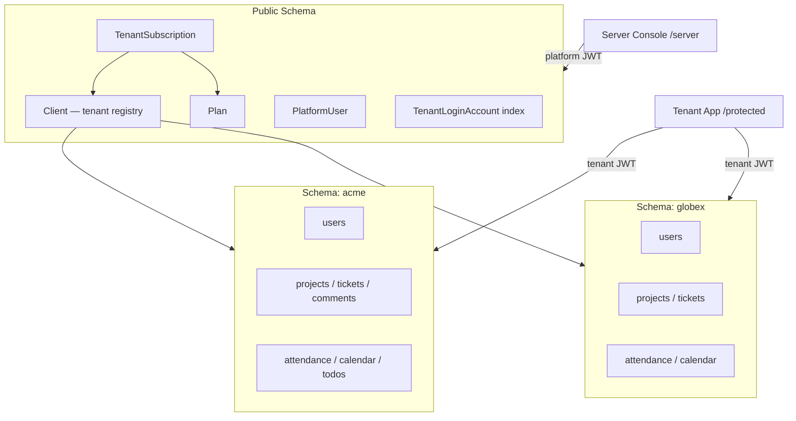
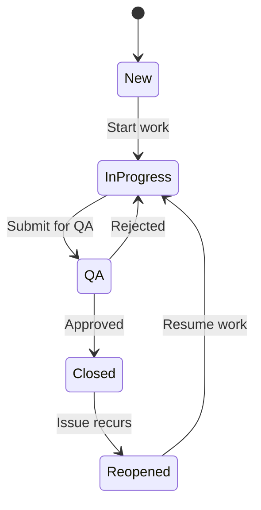

# Product Requirements Document (PRD)

## TicketHub — Multi-Tenant SaaS Project & Collaboration Suite

**Product:** TicketHub (by Technest Innovations)  
**Repository:** Ticket.np  
**Document version:** 2.0  
**Last updated:** July 2026  
**Status:** Living document — reflects implemented product plus planned enhancements

---

## Table of Contents

1. [Executive Summary](#1-executive-summary)
2. [Goals & Non-Goals](#2-goals--non-goals)
3. [User Personas](#3-user-personas)
4. [System Architecture & Tenancy](#4-system-architecture--tenancy)
5. [Subscription Plans](#5-subscription-plans)
6. [Roles & Permissions](#6-roles--permissions)
7. [Authentication & Access](#7-authentication--access)
8. [Feature Modules](#8-feature-modules)
9. [Platform Server Console](#9-platform-server-console)
10. [Frontend Application Map](#10-frontend-application-map)
11. [Integrations](#11-integrations)
12. [Non-Functional Requirements](#12-non-functional-requirements)
13. [Implementation Status & Known Gaps](#13-implementation-status--known-gaps)
14. [Roadmap](#14-roadmap)
15. [Technical Stack](#15-technical-stack)

---

## 1. Executive Summary

TicketHub is a **B2B SaaS workspace** that combines project management, ticket tracking, time logging, team collaboration, and lightweight HR operations (attendance and leave) in a single product. Organizations sign up as **tenants** with fully isolated data; a **platform operator** provisions tenants, assigns subscription plans, and manages the fleet from a separate server console.

The product targets small and mid-sized software teams and service organizations that need:

- Structured ticket workflows inside projects
- Visibility into who is working on what and for how long
- Optional office operations (check-in/out, leave approval, shared calendar)
- Strong data isolation between customers without operating separate databases

**Delivery model:** Web application (Next.js frontend + Django REST API), deployed via Docker Compose, with PostgreSQL schema-per-tenant isolation.

---

## 2. Goals & Non-Goals

### 2.1 Goals

| Goal | Description |
|------|-------------|
| **Tenant isolation** | Each organization's data lives in a dedicated PostgreSQL schema; cross-tenant leakage must be impossible at the database layer. |
| **Project-scoped collaboration** | Tickets, comments, media, and activity are visible only within projects a user belongs to (with role-based overrides for admins/managers). |
| **Operational clarity** | Managers see workload, hours, and ticket health; employees have a focused view of assigned work. |
| **Platform operability** | Server admins can create, configure, suspend, and permanently remove tenants without touching tenant business logic manually. |
| **Subscription readiness** | Plans define limits and feature flags; subscription state gates tenant login. |

### 2.2 Non-Goals (current release)

- Per-tenant subdomains for HTTP routing (single API host; tenant resolved from login + JWT)
- Mobile native apps
- Full ITSM / enterprise service desk (SLA engines, CMDB, asset management)
- Built-in billing/payment processing (plans are assigned administratively)
- Real-time WebSocket notifications (polling today)
- Public self-service tenant signup (registration is disabled by default)

---

## 3. User Personas

### 3.1 Platform Server Admin

- **Who:** Technest operator or DevOps staff managing the SaaS fleet
- **Needs:** Create organizations, assign plans, view usage, reset tenant admin passwords, deactivate or purge tenants
- **Access:** `/server/login` and Django platform admin (`/admin/`) with `PlatformUser` credentials

### 3.2 Tenant Admin

- **Who:** Organization owner or IT lead inside a customer company
- **Needs:** Manage users and roles, configure office hours, set login domain (`user@domain`), monitor org-wide metrics
- **Access:** Tenant dashboard → Users, Settings

### 3.3 Tenant Manager

- **Who:** Team lead or project manager
- **Needs:** Create projects, manage membership, assign tickets, approve leave, review team attendance and reports
- **Access:** Projects, Tickets, Reports, Leave approval, Team attendance views

### 3.4 Tenant Employee

- **Who:** Developer, designer, or individual contributor
- **Needs:** Work assigned tickets, log time, comment and attach files, check in/out, request leave, manage personal todos
- **Access:** My tickets, Projects (as member), Attendance, Todos, Calendar (read)

---

## 4. System Architecture & Tenancy

TicketHub uses **django-tenants** with a **single PostgreSQL database** and **one schema per tenant**.

### 4.1 Public schema (shared apps)

| Component | Purpose |
|-----------|---------|
| `Client` | Tenant registry: name, slug, `schema_name`, `login_domain`, active flag |
| `Domain` | Internal django-tenants domain records (not used for HTTP subdomain routing) |
| `Plan` | Subscription tier definition: limits and feature toggles |
| `TenantSubscription` | Active plan, status, start/expiry dates per tenant |
| `TenantLoginAccount` | Maps `username@login_domain` → tenant user for login resolution |
| `PlatformUser` | Platform server administrator accounts |

### 4.2 Tenant schema (isolated per organization)

Each tenant schema contains independent copies of:

- Users & department roles
- Projects & project documents
- Tickets, comments, media attachments
- Work logs & activity audit trail
- Attendance, leave, office settings
- Shared calendar events
- Personal todos
- In-app notifications

User `id=1` in schema `acme` is unrelated to `id=1` in schema `globex`.

### 4.3 Request routing

| Request path | Schema | Auth |
|--------------|--------|------|
| `/api/server/*` | Public | Platform JWT |
| `POST /api/auth/login/` | Public for lookup; auth inside tenant schema | Credentials |
| All other `/api/*` | Tenant from JWT `tenant_schema` or `X-Tenant-Schema` header | Tenant JWT |
| `/admin/` | Public | PlatformUser session |

---

## 5. Subscription Plans

Plans are defined in the public schema and assigned to tenants by the platform admin.

### 5.1 Plan attributes

| Field | Description |
|-------|-------------|
| `tier` | `standard` or `premium` |
| `monthly_price` | Display/billing reference (no payment gateway integrated) |
| `max_users` | Maximum users allowed in tenant |
| `max_projects` | Maximum projects allowed in tenant |
| `attendance_enabled` | Feature flag for HR module |
| `calendar_enabled` | Feature flag for shared calendar |
| `email_notifications_enabled` | Feature flag for outbound assignment emails |

### 5.2 Default tiers (seeded on platform setup)

| Capability | Standard (default seed) | Premium (default seed) |
|------------|-------------------------|------------------------|
| Max users | 25 | 100 |
| Max projects | 10 | 50 |
| Projects & tickets | ✓ | ✓ |
| Time tracking | ✓ | ✓ |
| Attendance & leave | ✓* | ✓* |
| Shared calendar | ✓* | ✓* |
| Email notifications | ✓* | ✓* |

\*Feature flags exist on the model and are editable in the server console; **API enforcement of per-module flags is partial** (see [§13](#13-implementation-status--known-gaps)).

### 5.3 Subscription enforcement (implemented)

- Tenant login blocked if organization is inactive
- Tenant login blocked if subscription is expired or cancelled
- `max_users` enforced when platform admin creates users via server API

---

## 6. Roles & Permissions

### 6.1 Platform role

| Role | Model | Capabilities |
|------|-------|--------------|
| **Server Admin** | `PlatformUser` | Manage tenants, plans, subscriptions; provision tenant users; purge organizations. Cannot browse tenant ticket data directly. |

### 6.2 Tenant system roles

| Role | Primary capabilities |
|------|---------------------|
| **Admin** | Full org access: all projects/tickets, user CRUD, office settings, calendar write, department roles, organization login domain |
| **Manager** | Create/edit projects, manage members, create/assign tickets, approve/reject leave, view team attendance and manager reports |
| **Employee** | Access member projects only; update tickets; log time; attendance/leave; personal todos; read calendar |

### 6.3 Department roles (orthogonal tags)

`UserRole` entities (e.g. Frontend, Backend, DevOps, QA, Design) are **visual/organizational labels** with custom colors. They do not grant additional permissions beyond system role.

### 6.4 Project-level access rules

- **Admins** see all projects in the tenant
- **Managers & employees** see projects they created or are members of
- **Tickets** require project membership, assignment, creator status, or manager/admin override
- **Project creators** cannot be removed from their own project's membership

### 6.5 Permission matrix (summary)

| Action | Admin | Manager | Employee |
|--------|:-----:|:-------:|:--------:|
| Manage tenant users | ✓ | — | — |
| Office settings | ✓ | — | — |
| Create project | ✓ | ✓ | — |
| Manage project members | ✓ | ✓* | — |
| Create/assign tickets | ✓ | ✓ | —** |
| Self-assign ticket | ✓ | ✓ | ✓ |
| Approve leave | ✓ | ✓ | — |
| Create calendar events | ✓ | — | — |
| View team attendance | ✓ | ✓ | — |
| Personal todos | ✓ | ✓ | ✓ |

\*Managers manage members on projects they control.  
\*\*Employees can update tickets they can access; assignment rules vary by endpoint.

---

## 7. Authentication & Access

### 7.1 Tenant staff login

1. User visits `/auth/login`
2. Enters credentials as `localuser@login_domain` (e.g. `admin@technest`) plus password
3. Backend resolves `TenantLoginAccount` in public schema → tenant schema
4. Validates tenant active + subscription valid
5. Returns JWT access/refresh tokens with claims: `tenant_schema`, `tenant_name`, `role`
6. Frontend stores tokens and `tenant_schema` in `localStorage`
7. All API calls include `Authorization: Bearer` and rely on middleware to set PostgreSQL `search_path`

### 7.2 Platform admin login

1. User visits `/server/login`
2. Enters platform username + password (`PlatformUser`)
3. Returns platform JWT (`auth_type: platform`, `role: server_admin`)
4. Separate token storage keys from tenant auth (`platform_access_token`)

### 7.3 Token refresh

- Tenant: `POST /api/auth/token/refresh/` — preserves `tenant_schema` in new access token
- Platform: `POST /api/server/auth/token/refresh/`

### 7.4 Django platform admin

- URL: `/admin/`
- Authenticates `PlatformUser` in public schema (not tenant `users` table)
- Manages: platform users, clients, domains, plans, subscriptions

### 7.5 Optional public registration

- `POST /api/auth/register/` exists but is **disabled** unless `ALLOW_PUBLIC_REGISTRATION=True`

### 7.6 Protected media

- Files stored under schema-scoped paths
- Served via authenticated API or time-limited signed URLs
- `MEDIA_ROOT` is not exposed as a public static route

---

## 8. Feature Modules

### 8.1 Project management

**Requirements**

- Managers and admins create projects with name, description, status (active/archived), optional GitHub repository URL
- Project membership is explicit; only members (plus admins) access project data
- Project documents: upload files (PDF, images, specs, markdown, etc.) attached to the project
- Project deletion restricted to project creator
- New members receive in-app notification when added

**Frontend:** `/protected/dashboard/projects`, `/protected/dashboard/projects/[id]`

---

### 8.2 Ticket management

**Requirements**

- Auto-generated IDs: `TKT-YYYYMMDD-####`
- Fields: title, description, type (bug/task/feature), priority (low/medium/high/critical), status, assignees (multi), creator, project
- Status workflow with validated transitions:

- Ticket media: attach images, videos, documents to tickets
- Search and filter by status, priority, type, project, assignee
- **My tickets** view for current user's assignments
- Auto work-log: timer starts on move to In Progress; stops on Closed; assignees cleared on Reopen
- Assignment triggers in-app notification and optional email (HTML template)

**Frontend:** `/protected/dashboard/tickets`, `/tickets/new`, `/tickets/[id]`, `/my-tickets`

---

### 8.3 Comments & collaboration

**Requirements**

- Threaded plain-text comments on tickets
- `@mentions` by full name or username → in-app notification to mentioned project members
- Comment attachments (images/media linked to comment)
- Comment author or manager/admin may delete comments

**Planned:** Rich text / Markdown editor

---

### 8.4 Time tracking (work logs)

**Requirements**

- Manual work log entries with start/end time, auto-calculated duration, optional notes
- `start_work` / `stop_work` API actions on tickets
- Visibility: employees see own logs; managers/admins see team logs
- Activity audit entries created for work sessions

---

### 8.5 Activity & audit trail

**Requirements**

- `ActivityLog` records: create, update, delete, status change, assignment, comment, work log
- Linked to tickets and related objects via generic foreign keys
- Visibility scoped by role and ticket/project access
- Recent activity feed on dashboards

**Planned:** Real-time WebSocket feed

---

### 8.6 Dashboards & reports

**Requirements**

| Dashboard | Audience | Key metrics |
|-----------|----------|-------------|
| Employee | Individual contributor | Assigned tickets by status, active work session, recent activity, hours logged |
| Manager | Team lead | Team workload, project health, member stats |
| Admin | Org admin | User/project/ticket totals, org-wide snapshot |

- Role-based report endpoints with configurable date windows (7–90 days)

**Planned:** PDF/CSV export, Kanban board

**Frontend:** `/protected/dashboard`, `/protected/dashboard/reports`

---

### 8.7 Attendance & leave (HR module)

**Requirements**

- **Office settings** (admin): work start/end times, weekend off-days, auto-mark-absent toggle
- **Check-in / check-out:** availability toggle within configured office hours
- **Daily attendance records:** present, absent, leave, neutral states with availability tracking
- **Attendance logs:** timestamped status changes per day
- **Team view:** managers/admins see team attendance; calendar month view
- **Leave requests:** employees submit date range + message; statuses: pending, approved, rejected, cancelled
- **Leave approval:** managers/admins approve/reject; approved leave marks attendance on working days
- **Holidays:** calendar holiday events exclude working days from leave calculations
- **Batch job:** `mark_absentees` management command for cron-based absent marking

**Frontend:** `/protected/dashboard/attendance`, `/protected/dashboard/leave`, `/protected/dashboard/settings`

---

### 8.8 Shared calendar

**Requirements**

- Event categories: holiday, programme, meeting, deadline, birthday, other (color-coded)
- Full-day or timed events with validated start/end
- Month/range API queries
- All users read; only admins create/edit/delete

**Frontend:** `/protected/dashboard/calendar`

---

### 8.9 Personal todos

**Requirements**

- Private per-user checklist (not shared across org)
- Priority: low, medium, high, urgent
- Status: pending, in progress, completed, cancelled (synced with completion flag)
- Optional due date/time; `completed_at` set automatically on completion

**Frontend:** `/protected/dashboard/todos`

---

### 8.10 Notifications

**Requirements**

- In-app notifications for: ticket assignment, project membership, comment @mentions
- Mark read, mark all read, delete
- Header badge with unread count; UI polls every 30 seconds
- Auto-prune read notifications older than 28 days

**Planned:** Push notifications, WebSocket real-time delivery, broader email triggers

**Frontend:** `/protected/dashboard/notifications`

---

### 8.11 User & organization management

**Requirements**

- Tenant admin: create users, assign system role, deactivate accounts, reset passwords
- Department role CRUD with display name and color
- Organization `login_domain` configurable by tenant admin (affects `user@domain` login format)
- Profile: update name, email, department roles; change own password

**Frontend:** `/protected/dashboard/users`, `/protected/dashboard/profile`

---

## 9. Platform Server Console

Separate product surface for platform operators.

### 9.1 Capabilities

| Feature | Description |
|---------|-------------|
| **Dashboard overview** | Tenant counts, recent organizations, navigation shortcuts |
| **Tenant list** | Search, filter, view usage (users/projects), create organization |
| **Tenant detail** | Edit name/login domain, assign/renew plan, list users, reset user passwords |
| **Deactivate / reactivate** | Soft-disable tenant access without deleting data |
| **Permanent purge** | Drop PostgreSQL schema after slug + platform password confirmation |
| **Plan management** | View and edit plan limits and feature toggles |

### 9.2 Tenant provisioning flow

1. Platform admin creates tenant with name, slug, login domain, initial admin credentials
2. System creates PostgreSQL schema, runs tenant migrations, registers domain record
3. Creates tenant admin user and `TenantLoginAccount` index entry
4. Optionally assigns subscription plan

### 9.3 Frontend routes

| Route | Purpose |
|-------|---------|
| `/server/login` | Platform sign-in |
| `/server/dashboard` | Overview |
| `/server/dashboard/tenants` | Organization list + create |
| `/server/dashboard/tenants/[id]` | Organization detail |
| `/server/dashboard/plans` | Subscription plans |

---

## 10. Frontend Application Map

### 10.1 Public

| Route | Description |
|-------|-------------|
| `/` | Marketing landing page |
| `/auth/login` | Tenant login |

### 10.2 Tenant workspace (`/protected/dashboard/*`)

| Route | Module |
|-------|--------|
| `/protected/dashboard` | Role-based home dashboard |
| `/protected/dashboard/projects` | Project list |
| `/protected/dashboard/projects/[id]` | Project detail |
| `/protected/dashboard/tickets` | Ticket list |
| `/protected/dashboard/tickets/new` | Create ticket |
| `/protected/dashboard/tickets/[id]` | Ticket detail |
| `/protected/dashboard/my-tickets` | Assignee-focused ticket view |
| `/protected/dashboard/reports` | Analytics reports |
| `/protected/dashboard/attendance` | Check-in/out & history |
| `/protected/dashboard/leave` | Leave requests |
| `/protected/dashboard/calendar` | Organization calendar |
| `/protected/dashboard/todos` | Personal todos |
| `/protected/dashboard/notifications` | Notification inbox |
| `/protected/dashboard/users` | User management (admin) |
| `/protected/dashboard/settings` | Office settings (admin) |
| `/protected/dashboard/profile` | User profile |

### 10.3 UX features

- Dark/light theme toggle
- Responsive layout with sidebar navigation
- Role-aware menu items (admin-only sections hidden from employees)
- Developer help modal for employee role

---

## 11. Integrations

| Integration | Purpose | Status |
|-------------|---------|--------|
| PostgreSQL + django-tenants | Schema-per-tenant data isolation | ✓ Implemented |
| JWT (djangorestframework-simplejwt) | Stateless auth, refresh rotation, blacklist | ✓ Implemented |
| Redis | Celery message broker | ✓ Implemented (Docker) |
| Celery | Async ticket assignment emails | ✓ Implemented (sync fallback if broker unavailable) |
| SMTP / console / file email backends | HTML assignment notification emails | ✓ Implemented |
| Whitenoise | Static file serving in production | ✓ Implemented |
| drf-spectacular | OpenAPI schema at `/api/docs/` | ✓ Implemented |
| GitHub URL on projects | Store repository link (no API sync) | ✓ Implemented |

**Planned:** GitHub/GitLab issue sync, browser extension, S3/MinIO media, WebSockets

---

## 12. Non-Functional Requirements

### 12.1 Security

- HTTPS, HSTS, secure cookies in production (`DEBUG=False`)
- XSS filter, `X-Content-Type-Options: nosniff`
- Tenant JWT `tenant_schema` must match request schema
- Platform and tenant JWT auth classes are separate; tokens are not interchangeable
- Rate limiting per schema: 10 req/min on auth, 100 req/min default, 20 req/min media upload
- Tenant purge requires platform password confirmation
- Django password validators on all user models

### 12.2 Performance & reliability

- API pagination (20 items default)
- Database `ATOMIC_REQUESTS` enabled
- Health check endpoints: `/api/health/`, `/health/`
- Docker healthchecks on all services

### 12.3 Operations

- Docker Compose: `db`, `backend`, `frontend`, `redis`, `celery_worker`
- Dev and prod compose overlays
- Migrations via `migrate_schemas` (shared + per-tenant)
- Default timezone: `Asia/Kathmandu`
- CI: GitHub Actions deploy pipeline on `develop` branch

### 12.4 Observability

- Activity audit trail within each tenant
- Server-side logging for auth and admin actions

**Planned:** Centralized monitoring, tenant isolation E2E test suite in CI

---

## 13. Implementation Status & Known Gaps

### 13.1 Fully implemented

- Multi-tenant schema isolation and JWT-based request routing
- Platform server console (tenants, plans, purge, user provisioning)
- Tenant auth with `user@login_domain` format
- Projects, tickets (full workflow), comments, mentions, media
- Work logs with auto-timer on status changes
- Dashboards and role-based reports
- Attendance, leave, calendar, todos
- In-app notifications + ticket assignment emails
- Protected media serving
- Theme toggle and responsive tenant UI

### 13.2 Partially implemented

| Area | Gap |
|------|-----|
| Plan feature flags | Model and UI exist; attendance/calendar/email APIs not consistently gated |
| Plan limits | `max_users` enforced on server user create only; `max_projects` not enforced on project create |
| Email notifications | Assignment emails only; not gated by `email_notifications_enabled` per plan |
| Celery | Optional; runs synchronously when broker unavailable |
| Media storage | Local filesystem; no S3/MinIO |

### 13.3 Documented future work

See [§14 Roadmap](#14-roadmap).

---

## 14. Roadmap

### 14.1 Near-term enhancements

- Enforce `max_projects` and plan feature flags at API layer
- Kanban / drag-and-drop ticket board
- Rich text or Markdown in ticket descriptions and comments
- PDF/CSV report export
- Real-time notifications (WebSockets or SSE)

### 14.2 Medium-term

- Global search across projects and tickets
- SLA tracking and resolution-time alerts
- Multi-step leave approval workflow with email notifications
- GitHub/GitLab integration (link commits/PRs to tickets)
- API versioning (`/api/v1/`)

### 14.3 Long-term

- Browser extension for ticket creation from GitHub
- Mobile application
- Public API for third-party integrations
- Self-service tenant signup and payment integration
- Custom fields, ticket dependencies, wiki/docs, automation rules, sprints

---

## 15. Technical Stack

| Layer | Technology |
|-------|------------|
| **Backend** | Python 3.11, Django 4.2, Django REST Framework |
| **Multi-tenancy** | django-tenants (PostgreSQL schema-per-tenant) |
| **Database** | PostgreSQL 18 |
| **Auth** | JWT (simplejwt), custom tenant + platform auth classes |
| **Task queue** | Celery + Redis |
| **API docs** | drf-spectacular (OpenAPI) |
| **Frontend** | Next.js (App Router), React, TypeScript |
| **Styling** | Tailwind CSS, custom design tokens, dark/light themes |
| **Deployment** | Docker Compose (dev + prod overlays) |
| **Static files** | Whitenoise (production) |

---

## Appendix A — API Surface (high level)

| Area | Base path |
|------|-----------|
| Tenant auth | `/api/auth/` |
| Platform auth | `/api/server/auth/` |
| Platform admin | `/api/server/tenants/`, `/api/server/plans/` |
| Users | `/api/auth/users/`, `/api/auth/organization/` |
| Projects | `/api/projects/` |
| Tickets | `/api/tickets/` |
| Time logs | `/api/timelogs/` |
| Comments | `/api/comments/` |
| Activity | `/api/activity/` |
| Dashboard | `/api/dashboard/` |
| Attendance | `/api/attendance/` |
| Calendar | `/api/calendar/` |
| Todos | `/api/todos/` |
| Notifications | `/api/notifications/` |
| Media | `/api/media/` |
| Health | `/api/health/` |
| OpenAPI | `/api/docs/` |

---

## Appendix B — Related documents

- `README.md` — Quick start and Docker setup
- `PROJECT_SCOPE.md` — Historical scope and early roadmap
- `docs/tenancy/architecture.md` — Multitenancy technical architecture
- `docs/tenancy/implementation_plan.md` — Tenancy migration plan
- `POPULATE_DATA.md` — Sample data seeding guide

---

*This PRD describes the product as built in the Ticket.np repository. For implementation details, refer to the codebase and architecture docs.*
