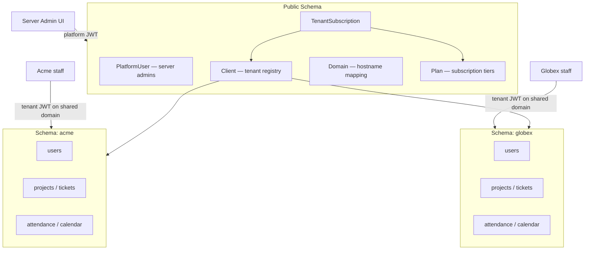
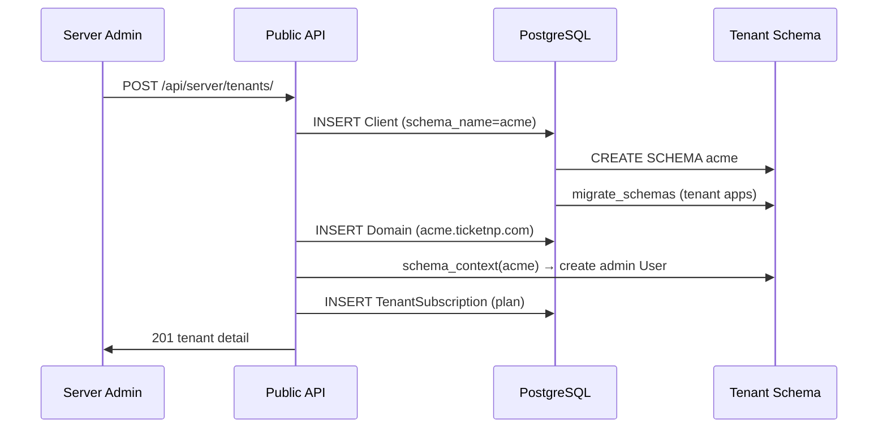

# Ticket.np Multi-Tenancy Architecture

**Model:** PostgreSQL schema-per-tenant via `django-tenants`  
**Platform admin:** Server admin (public schema) — inspired by RestaurantMS  
**Tenant isolation:** One PostgreSQL schema per customer; `search_path` set per request

---

## 1. System overview

Ticket.np evolves from a single-organization app into a **B2B SaaS platform**. Each customer (tenant) gets a fully isolated PostgreSQL schema containing their users, projects, tickets, attendance, and HR data. A **server admin** operates from the public schema and manages tenants, domains, plans, and subscriptions.



### Why schema-per-tenant (not row-level or DB-per-tenant)

| Approach | Verdict |
|----------|---------|
| **Single DB + `tenant_id`** | High refactor cost (~18 models), leak risk on HR data |
| **Schema-per-tenant** | Strong isolation, one Postgres instance, `django-tenants` maturity |
| **DB-per-tenant** | Overkill for current scale; ops burden × N |

RestaurantMS uses **row-level** isolation (`tenant` FK on every row). Ticket.np uses **schema-per-tenant** for stronger isolation — especially important for attendance, leave, and office settings — while mirroring RestaurantMS patterns for **server admin**, **plans**, and **subscriptions**.

---

## 2. Schema layout

### Public schema (SHARED_APPS)

| Table | Purpose |
|-------|---------|
| `customers_client` | Tenant registry (`schema_name`, `name`, `slug`, `is_active`) |
| `customers_domain` | Hostname → tenant (`acme.ticketnp.com`) |
| `customers_plan` | Platform subscription tiers |
| `customers_tenant_subscription` | One subscription per tenant |
| `platform_platformuser` | Server admin accounts (no tenant FK) |

### Per-tenant schema (TENANT_APPS)

All existing business apps, replicated per schema:

- `users`, `projects`, `tickets`, `timelogs`, `comments`, `activity`
- `calendar`, `todos`, `attendance`, `notifications`, `dashboard`, `core`

Each schema has its own `users` table. User `id=1` in schema `acme` is unrelated to `id=1` in schema `globex`.

---

## 3. Role model

### Server admin (`platform.PlatformUser`)

- Lives in **public schema only**
- Authenticates at `/api/server/auth/login/` on the platform host
- JWT includes `role: server_admin` — no `tenant_schema` claim
- Manages tenants, plans, subscriptions, tenant user provisioning
- Cannot access tenant business data directly (must use server API + `schema_context`)

### Tenant roles (`users.User` — unchanged semantics)

| Role | Scope |
|------|-------|
| `admin` | Full control within tenant |
| `manager` | Project authority |
| `employee` | Contributor |

Tenant users authenticate on the **shared API domain** with an organization slug at login. JWT includes `tenant_schema` and is rejected if the request schema does not match.

---

## 4. Tenant resolution

### Single domain for all tenants

Every tenant uses the **same API host** (e.g. `api.ticketnp.com` or `localhost:8000`). There are no per-tenant subdomains.

| Route | Schema |
|-------|--------|
| `/api/server/*` | `public` — server admin, tenant registry, subscriptions |
| `/api/auth/login/` | `public` for routing; credentials validated inside the tenant schema from `organization` |
| All other `/api/*` | Tenant schema from JWT `tenant_schema` claim (or `X-Tenant-Schema` header as fallback) |

### How a tenant user signs in

1. User enters **organization** (slug or schema name, e.g. `main`), username, and password.
2. Backend resolves `Client` in the public schema, then authenticates inside that tenant's PostgreSQL schema.
3. JWT includes `tenant_schema`; middleware sets `search_path` on every subsequent request.
4. Frontend stores `tenant_schema` in `localStorage` after login.

### Domain table (django-tenants requirement)

`customers_domain` rows use internal placeholders like `main.internal` — they are **not** used for HTTP routing. Routing is JWT/header-based on one shared domain.

### Server admin

Server admins authenticate at `/api/server/auth/login/` on the same host. Platform JWT has `token_type: platform` and no `tenant_schema`.

---

## 5. Subscription model

Adapted from RestaurantMS, stored in **public schema** and linked to `Client`:

```python
Plan
  name, tier (standard | premium)
  monthly_price
  max_users, max_projects
  attendance_enabled, calendar_enabled
  email_notifications_enabled

TenantSubscription
  client (OneToOne → Client)
  plan (FK → Plan)
  status (active | expired | cancelled)
  started_at, expires_at, notes
```

### Enforcement points

| When | Check |
|------|-------|
| Tenant login / token refresh | Block if tenant inactive or subscription expired |
| User creation | Enforce `max_users` |
| Project creation | Enforce `max_projects` |
| Attendance/calendar APIs | Require plan feature flags |

Server admin assigns plans via `POST /api/server/tenants/{id}/assign-plan/`.

---

## 6. Server admin API

Mirrors RestaurantMS `/api/v1/server/` namespace:

| Endpoint | Action |
|----------|--------|
| `GET /api/server/tenants/` | List tenants with subscription summary |
| `POST /api/server/tenants/` | Provision tenant (schema + domain + admin user + plan) |
| `GET /api/server/tenants/{id}/` | Tenant detail + usage |
| `PATCH /api/server/tenants/{id}/` | Update name, active status |
| `POST /api/server/tenants/{id}/deactivate/` | Soft-disable tenant + staff |
| `POST /api/server/tenants/{id}/reactivate/` | Re-enable tenant + staff |
| `POST /api/server/tenants/{id}/purge/` | Drop schema permanently (password confirm) |
| `GET/POST /api/server/tenants/{id}/users/` | List / create tenant users |
| `POST /api/server/tenants/{id}/users/{uid}/reset-password/` | Reset tenant user password |
| `POST /api/server/tenants/{id}/assign-plan/` | Assign or renew subscription |
| `GET/POST/PATCH /api/server/plans/` | CRUD platform plans |
| `POST /api/server/auth/login/` | Server admin JWT |
| `POST /api/server/auth/token/refresh/` | Refresh platform JWT |

---

## 7. Tenant provisioning flow



`Client.auto_create_schema = True` triggers schema creation on save.  
`Client.auto_drop_schema = True` drops schema on purge.

---

## 8. Authentication split

| Context | Endpoint | User model | JWT claims |
|---------|----------|------------|------------|
| Platform | `/api/server/auth/login/` | `PlatformUser` | `role=server_admin` |
| Tenant | `/api/auth/login/` | `users.User` | `role`, `tenant_schema`, `tenant_name` |

`TenantJWTAuthentication` rejects tokens where `tenant_schema` ≠ current connection schema.

---

## 9. SHARED_APPS vs TENANT_APPS

```python
SHARED_APPS = [
    'django_tenants',
    'apps.customers',
    'apps.platform',
    'django.contrib.contenttypes',
    'django.contrib.sessions',
    'django.contrib.messages',
    'django.contrib.staticfiles',
    'rest_framework',
    'corsheaders',
    'drf_spectacular',
    'django_filters',
    'whitenoise',
]

TENANT_APPS = [
    'django.contrib.contenttypes',
    'django.contrib.auth',
    'django.contrib.admin',
    'rest_framework_simplejwt',
    'rest_framework_simplejwt.token_blacklist',
    'apps.users',
    'apps.projects',
    'apps.tickets',
    # ... all business apps
]
```

`AUTH_USER_MODEL = 'users.User'` — tenant-scoped only.  
`PlatformUser` is a separate model, not `AUTH_USER_MODEL`.

---

## 10. Middleware order

```
1. apps.customers.middleware.TenantResolutionMiddleware   # JWT / header / refresh body
2. django.middleware.security.SecurityMiddleware
3. whitenoise.middleware.WhiteNoiseMiddleware
4. corsheaders.middleware.CorsMiddleware
5. apps.core.middleware.RateLimitMiddleware              # keys prefixed with schema
6. django.contrib.sessions.middleware.SessionMiddleware
7. django.middleware.common.CommonMiddleware
8. django.middleware.csrf.CsrfViewMiddleware
9. django.contrib.auth.middleware.AuthenticationMiddleware
10. django.contrib.messages.middleware.MessageMiddleware
```

---

## 11. URL routing

| URLconf | Path prefix | Routes |
|---------|-------------|--------|
| `config.urls_public` | `/api/server/*`, `/api/health/` | Server admin, tenant registry |
| `config.urls` | All other `/api/*` on shared domain | Tenant business APIs |

Both URLconfs are served from the **same host**. `TenantResolutionMiddleware` selects the PostgreSQL schema before routing.

```python
ROOT_URLCONF = 'config.urls'
PUBLIC_SCHEMA_URLCONF = 'config.urls_public'
```

---

## 12. Data migration (existing deployments)

**Critical:** `public` is reserved for shared tables. Legacy data must move to a named schema (e.g. `main`).

### Phase 1 — Infrastructure
1. Backup database
2. Deploy django-tenants settings
3. `python manage.py migrate_schemas --shared`

### Phase 2 — Legacy tenant
```bash
python manage.py create_tenant \
  --schema_name=main \
  --name="Main Organization" \
  --domain=main.internal
```

### Phase 3 — Move tables
```sql
ALTER TABLE users SET SCHEMA main;
ALTER TABLE projects SET SCHEMA main;
-- repeat for all tenant-app tables (see implementation_plan.md)
```

### Phase 4 — Sync
```bash
python manage.py migrate_schemas
```

### Phase 5 — Platform bootstrap
```bash
python manage.py createsuperuser
# or non-interactive:
# DJANGO_SUPERUSER_USERNAME=admin DJANGO_SUPERUSER_PASSWORD=<secure> \
#   python manage.py createsuperuser --noinput
```

---

## 13. Media storage

Upload paths must include schema name to prevent ID collisions across tenants:

```
media/{schema_name}/ticket_media/{id}/file.jpg
media/{schema_name}/project_documents/{id}/doc.pdf
```

---

## 14. Background jobs (Celery / cron)

All tenant-scoped commands must iterate tenants:

```python
from django_tenants.utils import get_tenant_model, schema_context

for tenant in get_tenant_model().objects.exclude(schema_name='public'):
    with schema_context(tenant.schema_name):
        mark_absentees()
```

Celery tasks receive `schema_name` kwarg and enter `schema_context` before ORM access.

---

## 15. Frontend architecture (phased)

### Phase A — Tenant app (existing Next.js)
- Single API base URL: `https://api.ticketnp.com/api` (or `localhost:8000/api` in dev)
- Login form includes **organization** field; store `tenant_schema` in localStorage after login
- Login blocked with subscription-expired message

### Phase B — Server admin app (new route group)
- Route group `(server)` — mirrors RestaurantMS
- `AuthGuard allowedRoles={['server_admin']}`
- Pages: `/server/tenants`, `/server/tenants/[id]`, `/server/plans`
- API client: `frontend/lib/server-api.ts`
- Post-login redirect: `/server/tenants`

---

## 16. Security invariants

1. Tenant A cannot query Tenant B — enforced by PostgreSQL `search_path`, not app filters
2. Tenant JWT `tenant_schema` must match the resolved request schema
3. Server admin JWT (`auth_type: platform`) cannot access tenant business routes
4. Subscription expiry blocks tenant staff login, not server admin
5. Tenant purge requires server admin password + slug confirmation
6. Rate limits scoped per schema to prevent cross-tenant bleed

---

## 17. Comparison with RestaurantMS

| Concern | RestaurantMS | Ticket.np |
|---------|--------------|-----------|
| Isolation | Row-level `tenant` FK | Schema-per-tenant |
| Server admin | `User` with `tenant=None` | Separate `PlatformUser` in public schema |
| Tenant registry | `Tenant` model | `Client` (django-tenants) |
| Subscriptions | `Plan` + `TenantSubscription` | Same shape, FK → `Client` |
| Tenant resolution | `request.user.tenant` | Subdomain + `Domain` table |
| Provisioning | `create_tenant_with_admin()` | Same flow + `auto_create_schema` |
| API namespace | `/api/v1/server/` | `/api/server/` |

---

## 18. Operational checklist

- [ ] `ALLOWED_HOSTS=.ticketnp.com,platform.ticketnp.com`
- [ ] `CSRF_TRUSTED_ORIGINS` includes all tenant subdomains
- [ ] Docker entrypoint uses `migrate_schemas`
- [ ] Backups: single Postgres dump covers all schemas
- [ ] Monitoring: per-tenant schema size via `pg_namespace`
- [ ] E2E tests: tenant isolation + server admin flows

See `implementation_plan.md` for phased rollout and file-level change list.
